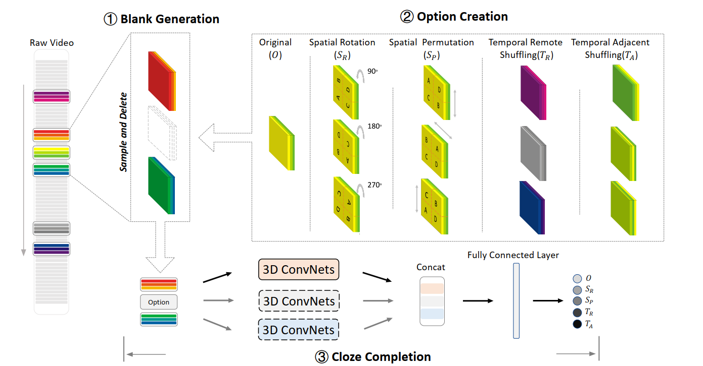
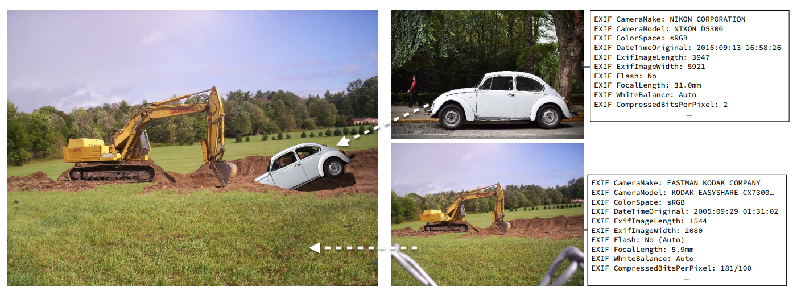
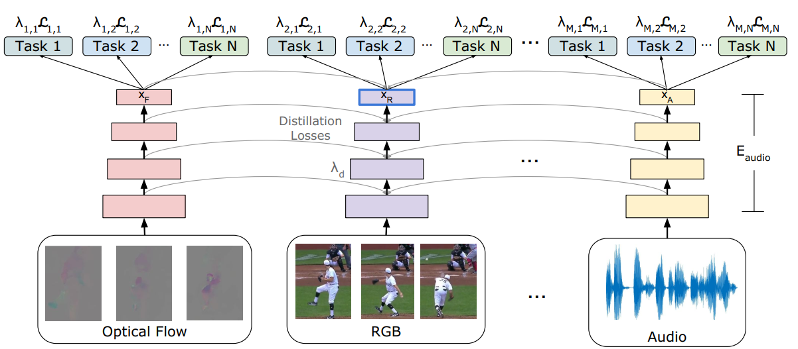
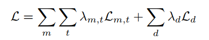
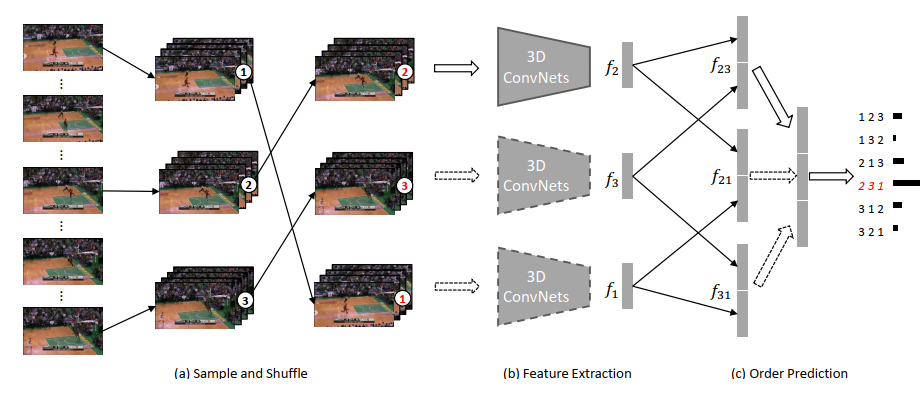
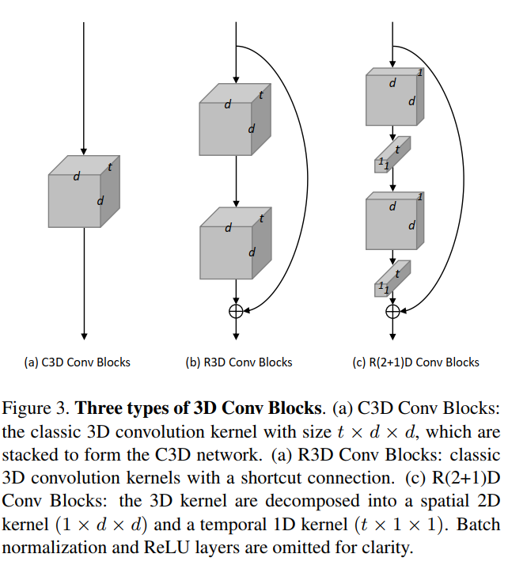
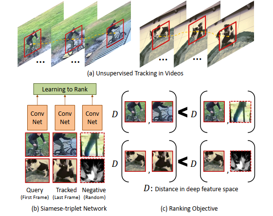
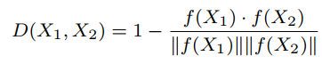

**Video Cloze Procedure for Self-Supervised Spatio-Temporal Learning **

AAAI oral 文章，信工所的工作，说明了起名字的重要性，拔高文章表达 开源

作者认为自监督学习就是完形填空

本质上我认为就是基于unlabeled的data，手工设计标签来进行学习，从而提高泛化能力。

**Fighting Fake News: Image Splice Detection via Learned Self-Consistency **

ECCV2018 很有趣的文章 开源

基于自监督学习来检测fake image，手工设计的特征为EXIF信息，来自两张不同的图片是具有不同的EXIF信息的，从而指导网络学习，只需要real img，而不需要fake img 的数据集，避免了标定问题。

**Evolving Losses for Unlabeled Video Representation Learning **

CVPR2020 Google brain

认为无监督学习是一个多模态多任务的学习过程，通过优化加权的损失函数，得到不同任务的重要程度。

**Self-Supervised Video Representation Learning With Odd-One-Out Networks **

CVPR2017

**Self-supervised Spatiotemporal Learning via Video Clip Order Prediction **

CVPR2019 自监督在order detection上的应用，打乱顺序，识别。

目前来看，自监督的网络结构相对比较简单，怎样引入更多的knowledge来指导自监督学习挺重要，因为现在自监督从大量的数据中提取的信息还是不够精细

C3D R3D R(2+1)D 三种基于video clips的处理方法

**Unsupervised Learning of Visual Representations using Videos **

CVPR2015 比较老的一篇文章

triplet设置，使得网络找到更接近的部分，从而实现跟踪

用余弦距离来衡量两张图片之间的距离

