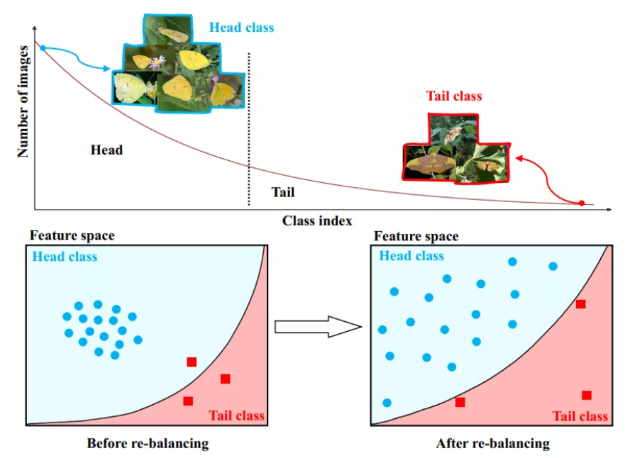
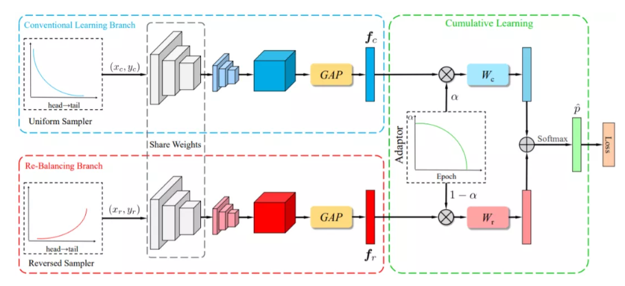

了解一个领域发展的情况：看experiments

第一篇工作发表的时间，一共比较了多少篇经典工作，最后一篇工作的点数

**long-tail问题**

BBN:再平衡策略在一定程度上损害了表征学习，提出了一种统一的双边分支网络（BBN），可以同时兼顾表征学习和分类器学习，大幅提升了长尾问题的识别性能。

类别再平衡、再分类、解决long-tail问题

** domain shift问题**

**CNN是否存在平移和尺度的不变性和相等性**

卷积与池化改变了平移相等性，FC层则不会。

