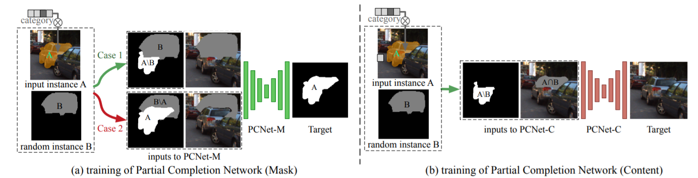
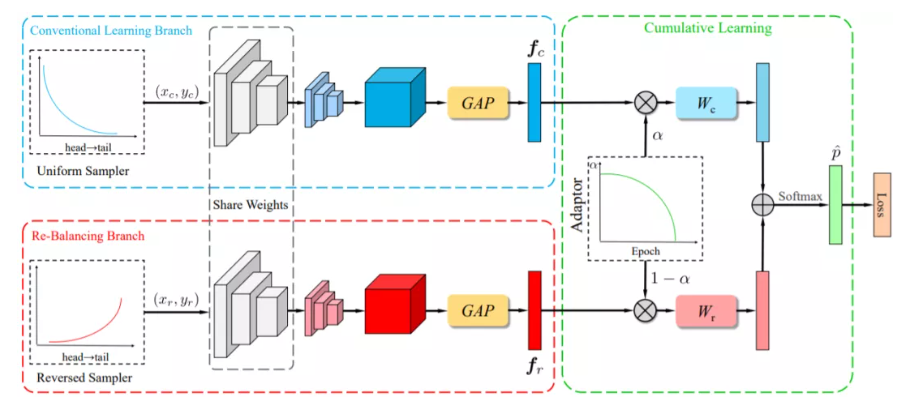

### 2020-4-13

------

**Self-Supervised Scene De-occlusion **

CVPR2020 oral   self-supervised learning

[info](https://mp.weixin.qq.com/s?__biz=MzI5MDUyMDIxNA==&mid=2247494449&idx=1&sn=302952751a9828d5c743889940fd0583&chksm=ec1c06c8db6b8fde7ff6a8600e857e5ceaac6126d4d7c10a2c9f52edf0fd2440213158b69c91&scene=126&sessionid=1587091145&key=8f00d94507c03ca954309d743b9c4f80ee6307cb25531e014185af6aaf2c0db6ba16f23deeeb66d3c527dfb96268062ce63138f5c58d1be2d349b66879dfa626d3b37adf8b7e23e924083f3e5df2acca&ascene=1&uin=Mjg2NjczNjUyNQ%3D%3D&devicetype=Windows+10&version=62090045&lang=zh_CN&exportkey=A9OrArqvtqM21ngteJwP%2BEo%3D&pass_ticket=DVgvio6UV%2B3zOGNCHIOys6t3zHwQacVxLarLUProHl77hzNl%2BxHNgvfkC9uNglws)

### 2020-4-15

------

**BBN: Bilateral-Branch Network with Cumulative Learning for Long-Tailed Visual Recognition**

